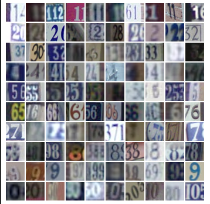

Para este proyecto se realizará una implementación de una red neuronal convolucional para un problema de clasificación de imágenes. 

El DataSet a utilizar será SVHN (the Street View House Numbers), que consta de fotos de distintas calidades de números exteriores de casas.

Justificación
Para problemas de clasificación de imágenes, las redes convolucionales han probado ser ideales debido a las capas de CONVOLUCIÓN, que aplican filtros a las imágenes de entrada. 
Estos filtros actúan como detectores de características y son capaces de aprender automáticamente características importantes, como bordes, texturas, formas y patrones, a través del proceso de entrenamiento.

Liga para obtener el dataset: http://ufldl.stanford.edu/housenumbers/

